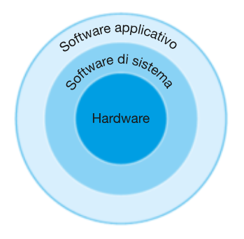

## What’s Behind a Program?

Most of the programs we use every day, from the browser to watch YouTube videos, to the photo editor or the self-driving software in Teslas, contain millions of lines of complex high-level code like Python, Java, or C.

However, the computer can only execute simple low-level instructions. To transform high-level code into low-level code, numerous layers of software are required to translate each instruction into simpler ones.

These software layers are organized hierarchically, as shown in the following figure.

In the outer circle, we find the **application software**, which refers to all the apps and programs. If you have ever used a browser to surf the web or an app to edit a photo, you have already interacted with application software. These programs operate thanks to system software working behind the scenes.

The components of **system software** are represented in the middle circle between hardware and application software. System software has several components, but two are essential in all modern computers: the operating system and the compiler.

The **operating system** is responsible for managing memory, processes, and peripherals like keyboards, screens, and hard drives, allowing programs to communicate with hardware without needing to understand the physical workings. Linux, iOS, and Windows are the most widely used operating systems.

**Compilers** perform a crucial function: allowing hardware to execute programs. Essentially, a compiler is a program that translates source code written in languages like Python or Java into machine language, a series of instructions that the computer’s processor can directly understand. Without this translation, the code could not be executed.

