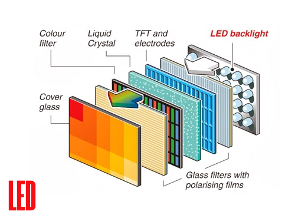

# LCD Display

The name "LCD Display" stands for Liquid Crystal Display.

### What are liquid crystals?
In chemical terms, liquid crystals are [_organic compounds_](./insights/organicCompounds.md) made up of molecules shaped like cylinders (similar to a stick) or disks. These molecules have a key physical property: they can orient themselves (rotate) when an electric voltage is applied. Depending on their inclination, the amount of light passing through them can be adjusted.

### How is it made?

An LCD screen is made up of several layers:

The first, innermost layer is a panel that emits white light, which is used to backlight the screen.

Then, the light emitted by the backlight panel passes through a polarizing filter. This filter’s function is to polarize the light, allowing only light waves vibrating in a specific direction (toward the user’s eyes) to pass through. At this point, the light is still white and needs further processing to create the images we see on the screen.

After the polarizer, there is the liquid crystal layer, which is controlled by applying voltage through the use of transistors to modulate the amount of light passing through. This is the layer that gives the screens their name (Liquid Crystal Display). Each pixel on the screen consists of a unit of liquid crystals, and as mentioned, their transparency or opacity is controlled electrically to modulate the amount of light passing through each pixel.

After the liquid crystal layer, there is a second polarizer, arranged perpendicularly to the first one. Only light that has undergone a rotation in the liquid crystal layer can pass through this second polarizer, allowing control over the brightness of each pixel.

Finally, to produce colors, the light passes through a color filter. Each pixel is subdivided into red, green, and blue (RGB) sub-pixels. By varying the amount of light passing through each sub-pixel, the combination of colors needed to create the final image is achieved.

All these layers work together in synchronization, allowing LCD screens to generate high-definition images with relatively low energy consumption.

