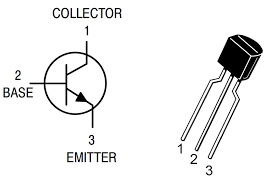
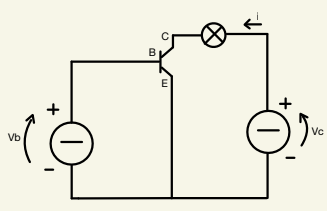
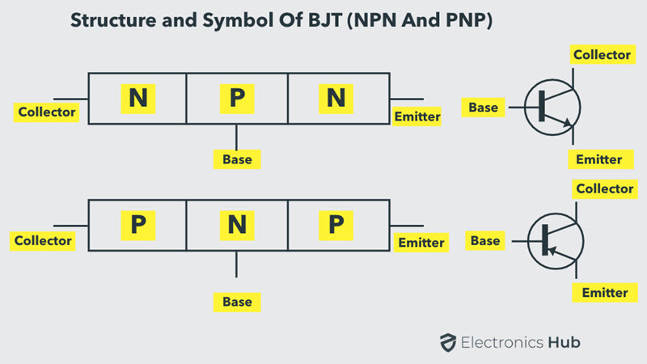
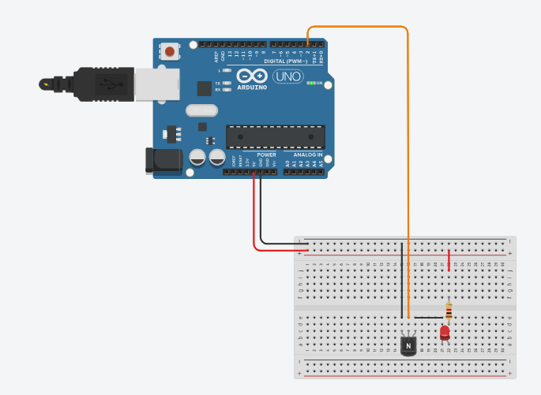

# Transistor

.png)

Uno dei componenti elettronici in maggior numero presente nei calcolatori è il **transistor**.

Qualsiasi dispositivo tu stia usando per leggere questo testo, che sia uno smarthphone o un pc, contiene un processore composto da milioni di microscopici tranisitor.

Il processore M1 Max prodotto nel 2021 dall'azienda di Cupertino è realizzato da ben 57 miliardi di transistor miniaturizzati. Un numero impressionante se consideriamo che sono tutti contenuti in circa 400 mm², ovvero in uno spazio grande quanto una mosca.

Comparazione grandezza transistor con un mitocondrio:


I transistor possono funzionare sia come interruttori che come amplificatori, controllando il flusso di corrente elettrica che li attraversa. 

Nella più semplice delle applicazioni vengono usati come interrutori elettrici. Questo comportamento è alla base della realizzazione delle porte logiche fondamentali come: AND, OR, NOT, che costituiscono i mattoni della logica digitale. Collegando in specifiche configurazioni più transistor è possibile realizzare qualsiasi porta logica.

Ci sono tanti tipi di transistor con funzionalità simili tra loro. I due più utilizzati sono i **BJT** (quello che analizzeremo) e i MOSFET.

### Come sono fatti i bjt?

I BJT (**B**ipolar **J**unctio **T**ransistor) sono formati da tre terminali:

-Emettitore (E)

-Base (B), chiamato anche terminale di controllo.

-Collettore (C)



#### Funzionamento

Se la base (B) riceve una tensione in ingresso, superiore ad una tensione di soglia (0.6V - 0.7V), il transistor lascia passare corrente tra  l'emettitore (E) e il collettore (C).



In questo modo il BJT si comporta da interruttore pilotato dalla tensione. Quando è acceso (ON), ovvero riceve tensione alla base, "l'interruttore" si chiude permettendo alla corrente di passare facendo accendere la lampadina. Viceversa, se non arriva tensione alla base il transistor si comporta come un interruttore aperto interrompendo il flusso di corrente. La lampadina risulterà spenta.


#### Come vengono costruiti

I transistor sono formati in Silicio o Germanio.
Il silicio puro è un semiconduttore, significa che in grado di condurre elettricità e calore meglio di un materiale isolante ma peggio di un conduttore.

Il transistor bjt è realizzato da 3 regioni (N e P) unite tra loro. 


(la base è molto più sottile rispetto alla zona dell'emettitore e del collettre)

Queste regioni sono realizzate attraverso un processo chiamato **drogaggio**, che implica l'introduzione di impurità in un semiconduttore puro per modifare le sue proprietà elettriche. Nel caso di un transistor NPN, la regione dell'emettitore è tipicamente drogata con un elemento del gruppo V della tavola periodica, come il fosforo. Questo processo di drogaggio introduce un eccesso di elettroni nel materiale, creando una concentrazione elettroni nell'emettitore. La base, invece è leggermente drogata con un elemento del gruppo III, come il boro, che crea una carenza di elettroni producendo così delle lacune ovvero dei portatori di carica positiva. Infine il collettore è anch'esso drogato come l'emettitore ma con una concentrazione inferiore di elettroni. 
Le lacune nella zona della base sono in numero inferiore rispetto agli elettroni liberi nell'emettitore.

#### Movimento degli elettroni
Quando si applica una tensione tra l'emettitore e il collettore, con la base a una tensione inferiore rispetto al collettore, si crea un campo elettrico che "attira" gli elettroni dall'emettitore verso il collettore.
Gli elettroni partono dall'emettitore e vengono iniettati nella base, che essendo molto sottile e poco drogata, pochi elettroni si combinano con le lacune. La maggior parte degli elettroni continua il loro cammino verso il collettore, spinti dal campo elettrico.

Una volta nel collettore, gli elettroni creano una corrente che fluisce nel circuito.

#### Realizzazione del circuito
Se si ha a disposizione un scheda Arduino (o una simile), una breadboard un transistor BJT, un led, una resistenza e dei cavi (jumper) potete realizzare un circuito per vedere in azione il transistor.

In questa prova andremo a far accendere e spegnere il led rosso applicando e togliendo tensione alla base del transistor. 

La base sarà collegata al pin 2 della scheda Arduino che ciclicamente attiverà il pin (ON - OFF).

**schema di collegamento:**



**codice:**

da caricare sulla scheda arduino
```cpp
const int ledPin = 2;


const int delayTime = 1000;  // 1000 ms = 1 sec

void setup() {
  
  pinMode(ledPin, OUTPUT);
}

void loop() {
  //  PIN ON
  digitalWrite(ledPin, HIGH);
  // wait
  delay(delayTime);
  // PIN OFF
  digitalWrite(ledPin, LOW);
  // wait
  delay(delayTime);
}
```

Si può anche utilizzare un semplice interruttore per comandare il segnale in input alla base del transistor senza dover utilizzare una scheda arduino.

#### Come vengo realizzati?
Realizzare un dispositivo di dimensioni così piccole non è affato una sfida semplice. Sono poche le aziende in grado di realizzare processori con miliardi di questi piccoli componenti, se oggi ne siamo in grado è solo grazie agli enormi sforzi di ricerca e sviluppo degli anni passati. La complessità che c'è dietro alla produzione di massa dei processori è strabiliante.

Per approfondire, qesto video YouTube descrive in modo chiaro l'intero meccanismo di produzione dei microprocessori: 
[How are Microchips Made?](https://youtu.be/dX9CGRZwD-w?si=ZWqCJH8OUsNSq-VJ)